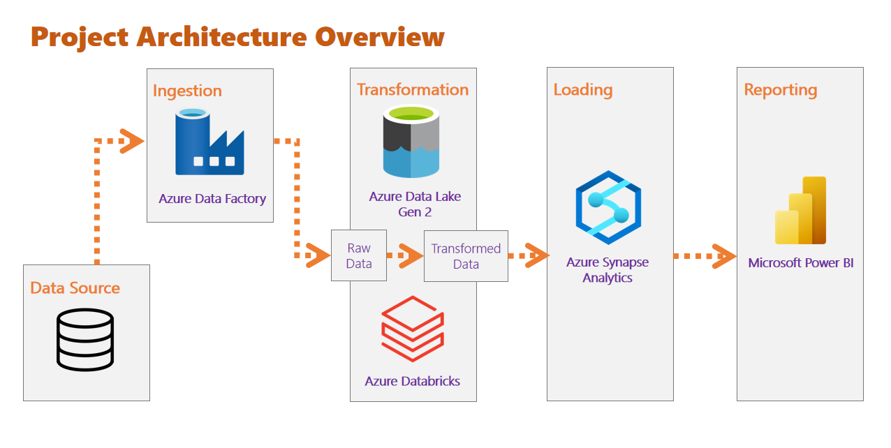

#### Azure BI Stack
# Azure Data Warehouse & Power BI

## Objective:

The objective of this project was to create an end-to-end data platform on Azure-based architecture for sales performance analysis. The source data goes for ETL process using Azure data services and sales dashboard creation with Power BI. 

## Using:

- Azure Portal
  - Setting up resource group with required services
- Azure Data Factory
  - Creating the extraction pipeline from source to ADLS
- Azure Data Lake Storage Gen2
  - Storage of raw data(staging) and transformed data
- Databricks
  - Apache Spark data transformation
  - Loading data to target location
- Synapse Analytics
  - Loading the transformed data
  - SQL data analysis
- Microsoft Power BI
  - Data reporting with visualizations, DAX and publishing to service

